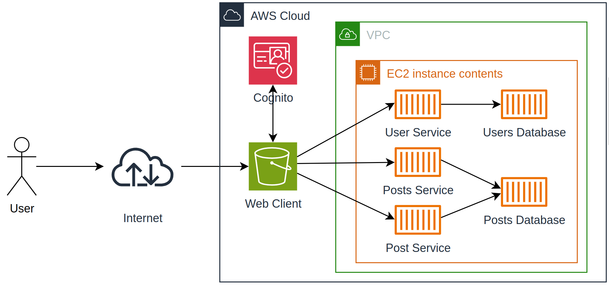

# Microservicios con Quarkus

## Clonar el proyecto

Para clonar este proyecto, debe ejecutar el siguiente comando:

```
git clone https://github.com/julianCS21/AREP08.git
```

### Prerrequisitos

Para hacer uso de esta aplicación debe tener instalado lo siguiente:
+ Java - Lenguaje de programación orientado a objetos.
+ Quarkus - Ejecución eficiente de aplicaciones Java en contenedores Kubernetes.
+ JWT - Decodificación, verificación y generación de JSON Web Tokens.
+ Maven - Herramienta para automatizar la gestión y construcción de proyectos Java. 
+ Docker - Herramienta para gestionar el ciclo de vida de contenedores.
+ AWS - Plataforma de computación en la nube.

## Descripción del proyecto

El proyecto es una aplicación web estilo Twitter que permite autenticarse y publicar posts en un único hilo, el proyecto está compuesto por un cliente JS alojado en un bucket de S3 de AWS, tres microservicios, cada uno para las entidades Post, User y Stream(hilo), cada uno de estos microservicios está dentro de un contenedor distinto y a su vez todos estos dentro de una instancia EC2 de AWS.

## Arquitectura de la aplicación



### Ejecutar el proyecto en AWS

Instalar Docker, haciendo uso del siguiente comando:

```
sudo yum install -y docker
```

Inciamos el servicio y lo activamos para que se inicie cada vez que iniciamos la máquina

```
sudo service docker enable
sudo service docker start
```
Creamos una red de Docker

```
sudo docker network create my_network
```

Ejecutamos los contenedores
```
sudo docker run -d -p 8080:8080 --name post-service --network my_network miguels007/post-service-img
sudo docker run -d -p 8081:8080 --name posts-service --network my_network miguels007/posts-service-img
sudo docker run -d -p 8082:8080 --name user-service --network my_network juliancs21/userservice
sudo docker run -d -p 27017:27017 -v mongodb:/data/db -v mongodb_config:/data/configdb --name postsdb --network my_network mongo:3.6.1 mongod
```
> **Advertencia**
El nombre del contenedor de la base de datos debe ser el mismo que está en el comando en donde lo creamos "postsdb".

> **Advertencia**
Asegurese de que el grupo de seguridad asociado a la instancia EC2 tenga las reglas de entrada para permitir el tráfico HTTP por los puertos 8080, 8081.

## Reporte de las pruebas 

## Video de la aplicación en funcionamiento

[URL del video](url-del-video)

## Construido con

+ [Maven](https://maven.apache.org/) - Dependency Management
+ [Quarkus](https://es.quarkus.io) - Supersonic Subatomic Java
+ [AWS](https://aws.amazon.com/es/) - Cloud Platform
+ [JWT](https://jwt.io) - JSON Web Tokens
+ [Docker](https://www.docker.com/) - Container Lifecycle Manager

## Autores

* **Miguel Angel Salamanca**  - [GitHub](https://github.com/miguelsalamanca007) - [LinkedIn](https://www.linkedin.com/in/miguel-%C3%A1ngel-salamanca-alarc%C3%B3n-714956265/)

* **Julián David Castillo Soto**  - [GitHub](url-git-julian) - [LinkedIn](url-linkedin-julian)

* **Juan Camilo Bazurto Arias**  - [GitHub](url-git-jcba) - [LinkedIn](url-linkedin-jcba)
